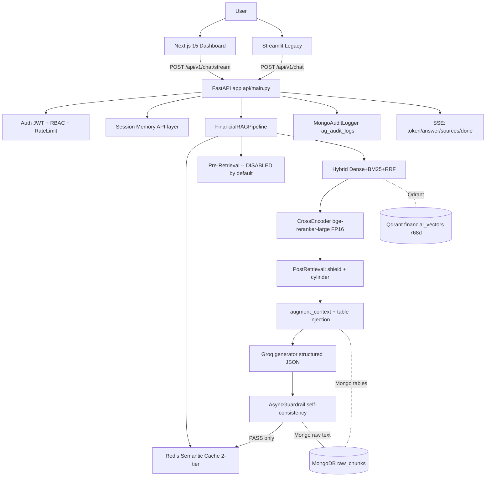
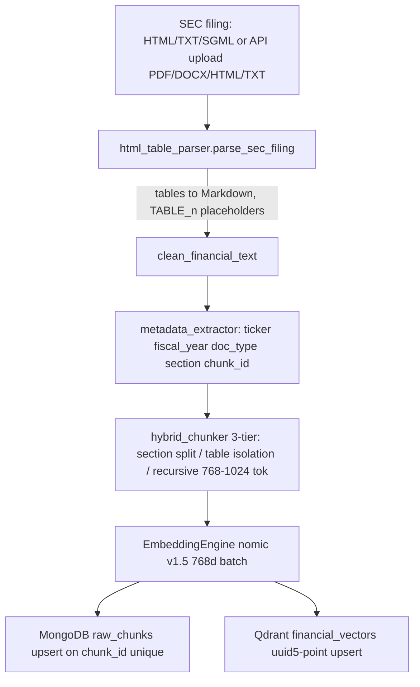
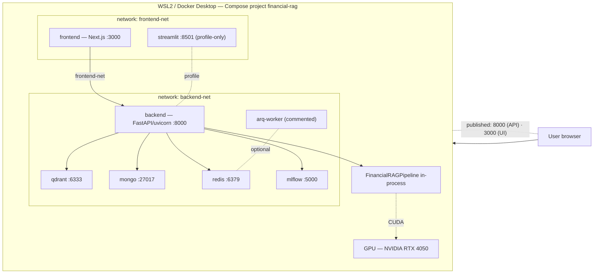

# PROJECT_MAP.md — Financial RAG System

> **Document status: REBUILT 2026-09-06**; **updated 2026-09-07** for the Docker Compose
> deployment (verified 6-service stack — §1/§16/§17/§23/§30).
> The codebase is the source of truth; this map was re-synchronized against the
> working tree (not git HEAD — see §26). Every statement below is verified against
> the current source unless explicitly marked **NOT VERIFIED** or **HISTORICAL**.
>
> **Accuracy conventions used in this document:**
> - **PRODUCTION** = implemented and used by the default runtime configuration.
> - **VALIDATED** = backed by tests / artifacts / live evidence.
> - **EXPERIMENTAL** = implemented but not the production default.
> - **KNOWN LIMITATION** = verified behavior/bug present in the current code.
> - **PLANNED** = designed but not implemented.

---

## 1. Executive Overview

**Financial RAG** is an enterprise-style Retrieval-Augmented Generation system that
ingests SEC 10-K filings (HTML/TXT/SGML and API uploads incl. PDF/DOCX), indexes them
into a dual database (MongoDB document store + Qdrant vector store), and answers
financial questions with a dense+sparse hybrid retriever, cross-encoder reranker,
table-aware context construction, a Groq LLM generator, and an async hallucination
guardrail. It exposes a FastAPI backend (auth, RBAC, rate limiting, SSE streaming,
audit logging) consumed by a Next.js 15 dashboard and a legacy Streamlit client.

Current runtime facts (verified 2026-09-07 at inspection):

| Layer | Actual technology |
|---|---|
| Embedding model | `nomic-ai/nomic-embed-text-v1.5` (768-dim, CUDA) |
| Reranker | `BAAI/bge-reranker-large` cross-encoder, **dtype default `float16`** (CPU → float32 fallback) |
| Vector store | Qdrant **server container** (compose service `qdrant` at `qdrant:6333`, volume `qdrant_storage`), collection `financial_vectors`, 768-dim Cosine |
| Document store | MongoDB **7 container** (compose service `mongo`; `financial_rag.raw_chunks`, plus `users`, `rag_audit_logs`) |
| Cache / queue / rate-limit / auth-blacklist | Redis **7 container** (compose service `redis`, `redis://redis:6379/0`) |
| LLM generation | Groq `openai/gpt-oss-120b` (primary), `openai/gpt-oss-20b` (fallback), temp 0.0, seed 42 |
| Judge LLM (eval only) | Groq `qwen/qwen3.6-27b` (primary), `openai/gpt-oss-120b` (fallback) |
| Backend | FastAPI + Uvicorn **container** (service `backend`, published `8000:8000`), CUDA/GPU runtime, optional Arq worker on Redis |
| Dashboards | Next.js 15.5.23 (React 19) **container** (service `frontend`, published `3000:3000`) primary; Streamlit legacy (`app/ui/streamlit_app.py`, profile-only) |
| MLflow | **server container** (service `mlflow`, `mlflow:5000`, file store `/mlflow`, volumes `mlflow_store` + `mlflow_artifacts`) |
| Runtime | **Docker Compose project `financial-rag` — 6 active services** (backend, frontend, mongo, redis, qdrant, mlflow) on WSL2 + Docker Desktop; backend container runs Python 3.12-slim + `torch 2.13.0+cu130` with **CUDA on NVIDIA GeForce RTX 4050 Laptop GPU** |

---

## 2. Project Goals

1. Parse, chunk, index, and analyze complex SEC filings (10-K/10-Q) for AAPL, MSFT, NVDA.
2. Preserve financial table structure through chunking (atomic table chunks).
3. Answer precise single-entity and cross-entity / multi-ticker comparison questions
   with grounded, verifiable figures.
4. Enforce low-latency via semantic caching and CUDA-accelerated embedding/reranking.
5. Provide enterprise guardrails: authN/authZ (RBAC), rate limiting, structured audit
   logging, hallucination screening, refusal behavior for unsupported questions.

---

## 3. System Capabilities

**Implemented and used (PRODUCTION):**

| Capability | Where |
|---|---|
| SEC HTML/SGML, TXT, PDF, DOCX parsing + table→Markdown | `src/1_ingestion/html_table_parser.py`, `app/api/parsers.py` (LlamaParse + pypdf/python-docx fallbacks) |
| Financial-text cleaning with notation protection | `src/1_ingestion/cleaning.py` |
| Metadata + fiscal-year + section + deterministic chunk ids | `src/1_ingestion/metadata_extractor.py`, `hybrid_chunker.py` |
| 3-tier token-bounded chunking (768–1024 tok, 20% overlap) | `hybrid_chunker.py` |
| Dual-store indexing (Mongo `raw_chunks` + Qdrant `financial_vectors`) | `database_indexer.py` |
| Dense + BM25 hybrid retrieval with RRF | `src/4_retrieval/hybrid_search.py` |
| Cross-encoder reranking (FP16 default) | `src/4_retrieval/reranker.py`, `post_retrieval.py` |
| Table shield (pass-through) + cylinder reorder | `table_shield.py`, `cylinder_reorder.py` |
| Query-grounded table injection + budgeted context | `src/pipeline.py::_augment_context` |
| Groq generation with structured JSON output + fallback | `src/5_generation/generator.py` |
| Guardrail: numerical self-consistency check + cache gating | `src/5_generation/async_guardrail.py` |
| Two-tier semantic query cache (Redis) | `src/2_caching/semantic_cache.py` |
| Multi-ticker balanced retrieval (incl. `ticker="ALL"`) | `src/pipeline.py::_balanced_ticker_subretrievals*` |
| Session-scoped conversation memory (API layer) | `app/api/main.py::_SESSION_MEMORY` |
| REST API: auth, RBAC, rate limits, SSE stream, audit logs, analytics, upload/ingest | `app/api/*` |
| Next.js dashboard (auth, chat, upload, analytics live) | `frontend/src` |

**Implemented, experimental/off by default:**
- Module-3 pre-retrieval intent routing + query expansion (`ENABLE_PRE_RETRIEVAL=False`) — has a known sync-path bug (§26).

**Designed but not implemented (PLANNED):**
- Multi-hop / agentic pipeline (`docs/MULTI_HOP_ROADMAP.md`).

---

## 4. Repository Structure

```
Financial_RAG/                          (canonical runtime: WSL2 native ext4)
│
├── app/
│   ├── api/
│   │   ├── main.py                     FastAPI app (~1200 lines): lifespan, endpoints,
│   │   │                               session memory, upload/ingest, SSE, audit, analytics
│   │   ├── schemas.py                  Pydantic request/response + AuditLogEvent
│   │   ├── worker.py                   Arq WorkerSettings + ingest/audit jobs + enqueue helpers
│   │   ├── rate_limiter.py             slowapi Limiter (Redis) + dynamic key (user_id vs IP)
│   │   ├── db_logger.py                MongoAuditLogger → rag_audit_logs
│   │   ├── parsers.py                  APIFileParser (HTML/SGML/TXT/PDF/DOCX)
│   │   ├── analytics.py                get_analytics_summary(days) over audit logs + raw_chunks
│   │   └── auth/
│   │       ├── __init__.py, router.py, jwt.py, service.py, dependencies.py
│   └── ui/streamlit_app.py             Legacy Streamlit dashboard (thin API client, no auth)
│
├── src/
│   ├── model_loader.py                 3-tier pipeline loader (cache → MLflow Production → direct)
│   ├── pipeline.py                     RAG orchestrator (~2331 lines) + FY/multi-ticker/context logic
│   ├── 1_ingestion/                    html_table_parser · cleaning · metadata_extractor ·
│   │                                   hybrid_chunker · database_indexer
│   ├── 2_caching/                      redis_client.py · semantic_cache.py
│   ├── 3_pre_retrieval/                intent_router.py · orchestrator.py · query_expansion.py ·
│   │                                   pre_retrieval_schemas.py      (EXPERIMENTAL, disabled)
│   ├── 4_retrieval/                    hybrid_search.py · reranker.py · post_retrieval.py ·
│   │                                   table_shield.py · cylinder_reorder.py
│   └── 5_generation/                   generator.py · async_guardrail.py · schemas.py ·
│                                       streaming_json.py
│
├── config/                             settings.py (env config) · logging_config.py (JSON logger)
├── evaluation/                         synthetic_generator.py · batch_runner.py ·
│                                       judge_evaluator.py · mlflow_tracker.py
├── test/                               29 test files, ~495 test functions (see §21)
├── scripts/                            ops / benchmark / diagnostic one-off scripts (see §22)
│   └── probes/                         stage runners + probes + _reingest_production.py
├── frontend/                           Next.js 15.5.23 app (see §15)
├── docs/                               AUDIT_*.md forensics · SUBSET/SYSTEM_AUDIT_REPORT.md ·
│                                       MULTI_HOP_ROADMAP.md · DEMO_SCRIPT.md · Financial_RAG.txt
├── data/                               AAPL/10-K, MSFT/10-K, NVDA/10-K (+FY2026 subdir),
│   │                                   NNDA/ (typo dir), UNKNOWN/ (bad uploads), qdrant_db(+_test)
├── mongodb_data/                       Persistent MongoDB data (WiredTiger)
├── backups/qdrant_db_backup_pre_reingest/  Pre-re-ingest Qdrant snapshot (2 files)
├── artifacts/                          test_dataset.csv · evaluation_results.csv ·
│   │                                   evaluation_scores.json (+_progress) · EVALUATION_SUMMARY.md ·
│   │                                   ab_benchmark/ · ab2_benchmark/ (FP16 & config A/B)
├── results/                            PNGs: Guardrail, Multi ticker, single retrieval,
│   │                                   mlflow_model_registry, mlflow_runs, Ingestion & Indexing
├── logs/                               rag_events.log (JSON) · uvicorn.log · audit_*.log ·
│   │                                   reingest_run*.log · mongod*.log · e2e_api.log ·
│   │                                   subset_*.log · various probe outputs
├── tmp/                                ops/e2e/admin helper scripts (Fix mapped in §22)
├── mlflow.db                           MLflow tracking (SQLite) — native store (pre-Docker;
│                                       the `mlflow` container uses file:/mlflow, §23)
├── mlruns/                             MLflow FileStore legacy artifacts (not primary)
├── requirements.txt                    pinned deps (torch 2.13.0+cu130, see §23)
├── docker-compose.yml                  containerized stack — 6 active services + streamlit
│                                       profile; arq-worker commented (§23)
├── app/Dockerfile                      backend multi-stage image (python:3.12-slim + torch cu130)
├── frontend/Dockerfile                 frontend multi-stage image (node:20-alpine, next build)
├── .dockerignore                       repo-root build-context exclusions
├── frontend/.dockerignore              frontend build-context exclusions
├── .env.example                        env template — copy to `.env` and fill (§23)
├── .env                                runtime env (see §17 — KEY MISMATCH finding)
├── .gitignore  README.md  PROJECT_MAP.md  (this file)
```

**Excluded / generated** (not source): `Financial_env/` (venv), `frontend/node_modules/`,
`frontend/.next/`, `data/qdrant_db*/` (locked store), `mlruns/`, `mongodb_data/`,
`__pycache__/`, `.pytest_cache/`.

---

## 5. Architecture Overview



**Request lifecycle (actual code path).** `app/api/main.py` `POST /api/v1/chat/stream`
(and `/chat`) restores session memory → calls `pipeline.query_stream()` / `query()` →
fiscal-year normalization, multi-ticker detection, optional cache, hybrid retrieval
(dense Qdrant ANN + BM25 → RRF) → post-retrieval (rerank top-8 → table shield
pass-through → cylinder reorder) → `_resolve_table_placeholders` → `_augment_context`
(table injection + budget) → `format_context_xml` → Groq generator (structured JSON)
→ guardrail → cache write-back (pass only) → response/SSE events → audit log.

> Detail: the pipeline **does not read `session_id`** — memory persistence is entirely
> an API-layer swap of the shared generator's `ConversationMemory` (§11).

---

## 6. Data Ingestion Pipeline



**Verbatim mechanics:**
- **Parsing** (`html_table_parser.py`): SGML `<DOCUMENT><TYPE>10-K` block extracted by
  regex; BeautifulSoup(lxml); inline XBRL tags unwrapped; `<script/style/head>` removed;
  every `<table>` converted via `pd.read_html` → `df.to_markdown(tablefmt="pipe")`, then
  replaced with `%%TABLE_{i}%%` placeholders. Output dict `{raw_html, clean_html,
  tables[], text_content, table_positions[], table_count}`.
- **Cleaning** (`cleaning.py::clean_financial_text`): 8-step pipeline that
  protects financial notation (`§FIN` placeholders for `(...)` negatives, `$` amounts,
  `M/B/K` scale, percentages), isolates `|...|` table regions, strips style/tags,
  decodes HTML entities, removes SEC boilerplate, collapses whitespace, restores tables
  and notation.
- **Metadata** (`metadata_extractor.py`):
  - Ticker: path regex (`AAPL|MSFT|NVDA|...` dir segment) → filename → content map → `UNKNOWN`.
  - Fiscal year priority: (1) **accession number** `-(\d{2})-\d{6}` → `2000+yy`
    (e.g. `0001045810-25-000023` → `2025`); (2) **content** regex `fiscal year ended/ending`
    in first 20k chars; (3) **path** `(?:10-K|10-Q)[/\\](?:.*?[/\\])?(\d{4})` (matches
    `FY2026` and `2024` dirs); else `UNKNOWN`.
  - API uploads: `app/api/main.py::_ingest_document` overrides with
    `re.search(r"(\d{4})", fiscal_year)` on the **query param** (so `FY2026` → `2026`);
    a raw `UNKNOWN` param leaves whatever the extractor computed.
  - Section: `identify_section` first-match on Item 1–14 / Part IV patterns, else `General`.
- **Chunking** (`hybrid_chunker.py`): Tier 1 split on `Item`/`Part` boundaries; Tier 2
  extracts contiguous `|…|` table blocks (atomic, with footnote lines) and maps
  parser tables to real sections via placeholder positions; Tier 3 recursive
  token-bounded split (tiktoken `cl100k_base`), paragraphs → sentences → words,
  overlap 204 tokens (20%).
  - **Chunk id** (deterministic): `md5(f"{ticker}:{fiscal_year}:{chunk_type}:{source_file}:{index}")[:12]`
    → `{TICKER}_{txt|tbl}_{hash}_{index:04d}` — fiscal_year is part of the hash.
- **Indexing** (`database_indexer.py`): `EmbeddingEngine` loads
  `nomic-ai/nomic-embed-text-v1.5` on CUDA (hard CUDA assertion), `normalize_embeddings=True`.
  Mongo doc = `{raw_text, chunk_type, token_count, **metadata, chunk_id}` upserted on a
  **unique `chunk_id` index**. Qdrant point id = `uuid5(NAMESPACE_DNS, chunk_id)`,
  payload fields exactly `{chunk_id, ticker, fiscal_year, section, doc_type,
  contains_table}`, batches of 100.

**Deduplication / re-ingestion behavior (KNOWN LIMITATION):** upsert-by-chunk-id is
idempotent; but stale ids are **never deleted**, so any boundary-content/metadata change
leaves orphans. Only a full reset (`scripts/probes/_reingest_production.py --reset` →
`drop_collection()`/`delete_collection()`) purges legacy chunks. This is exactly how the
`fiscal_year=UNKNOWN` supplemental chunk (`NVDA_txt_4e2da079297d_0000`) coexists with the
correct `2025`/`2026` NVDA chunks.

---

## 7. Retrieval Architecture

**Config (all verified in `config/settings.py`):**

| Constant | Value |
|---|---|
| `ENABLE_HYBRID_RETRIEVAL` | True |
| `HYBRID_TOP_K` | 40 |
| `HYBRID_RRF_K` | 60 |
| `HYBRID_DENSE_WEIGHT` / `HYBRID_SPARSE_WEIGHT` | 1.0 / 1.0 |
| `HYBRID_SPARSE_CORPUS_LIMIT` | 500 |
| `POST_RETRIEVAL_RERANK_TOP_N` | 8 |
| `POST_RETRIEVAL_INPUT_CHUNKS` | 40 |
| `POST_RETRIEVAL_CYLINDER_PATTERN` | (0, 2, 4, 6, 7, 5, 3, 1) |
| Qdrant `DEFAULT_CANDIDATE_K` (hybrid) | 40 |
| BM25 `_TOKEN_PATTERN` | `[a-z0-9]+(?:\.[0-9]+)?` (keeps decimals) |

**Verbatin flow (`src/4_retrieval/hybrid_search.py`, `src/pipeline.py`):**
1. **Pre-filter** before similarity: `ticker` / `tickers`(OR) / `fiscal_year` / `section`
   (`_build_qdrant_filter`). Legacy/single-ticker path uses `Filter(must=...)`; multi-ticker OR.
2. **Dense**: batch-embed all queries in one GPU pass; `QdrantIndexer.search(...,
   limit=top_k)` (no score threshold).
3. **Sparse**: BM25Okapi over pre-filtered Mongo corpus (≤500 chunks);
   token-overlap gate keeps only docs sharing ≥1 query token.
4. **Fusion**: `score_gained = Σ w·1/(k+rank+1)`, `k=60`; capped to `top_k=40`.
5. **Table rescue** (`_rescue_table_chunks`): on segment keywords, best `contains_table`
   BM25 hit is boosted to 0.5 (guaranteed top) and force-promoted post-rerank.
6. **Multi-ticker / cross-entity**: `_has_multi_ticker_intent` + comparison regex, or
   `ticker="ALL"` → `_apply_cross_ticker_bypass` strips ticker filter; per-ticker
   sub-retrievals (`_balanced_ticker_subretrievals_sync`, cap 4 tickers) merge & dedup by
   `chunk_id`; batched GPU rerank path `_batch_multi_ticker_retrieval_core` (concurrent
   per-ticker search + single `predict_scores` + per-ticker `aprocess_scored`).
7. **Hydration**: Qdrant holds metadata only; chunk text hydrated from MongoDB.

---

## 8. Reranking Architecture

Verified in `src/4_retrieval/reranker.py` (+ `config/settings.py`):

| Item | Value (actual) |
|---|---|
| Model | `BAAI/bge-reranker-large` |
| Framework | `sentence_transformers.CrossEncoder` |
| Device | `cuda` (env `RERANKER_DEVICE` override; auto via `torch.cuda.is_available()`) |
| **Dtype** | **`RERANKER_DTYPE` default `"float16"`**; `model_kwargs={"torch_dtype": torch.float16}`; forced `.to(dtype)` + per-parameter dtype verification (RuntimeError on mismatch) |
| CPU fallback | FP16 on CPU → FP32 with reason `"CPU fallback"` |
| Batch size | 32 |
| `top_n` | `DEFAULT_TOP_N = 8`; clamped to `[1, len(chunks)]` |
| Candidate input | 40 (from hybrid) |
| Warm-up | `warm_up()` = `_lazy_init` + no-op rerank |
| Concurrency | `threading.Lock` (`_infer_lock`) serializes `predict`; on exception degrades to `[0.0]*len(chunks)` |
| Validation | `device='cuda:0? (auto)', dtype=float16`, GPU VRAM ~fp16 measured in `artifacts/ab2_benchmark/fp16_vram_float16.json`; FP32↔FP16 regression passed (identical top-8 ranking) |

`PostRetrievalPipeline` (`post_retrieval.py`) chains: rerank 40→8 → `TableShield`
(`clean_enabled=False`, pass-through + table compaction `_compact_table_text` ~10×
shrink) → `cylinder_reorder` (n=8 pattern `0,2,4,6,7,5,3,1`).

---

## 9. Context Construction (`_augment_context`, `src/pipeline.py:1203-1524`)

**Budgets (module-level constants, all verified):**

| Constant | Value |
|---|---|
| `MAX_CONTEXT_DOC_CHARS` | 1500 |
| `MAX_INCOME_TABLE_CHARS` | 8000 |
| `MAX_COMPACT_INCOME_CHARS` | 5000 |
| `MAX_PRODUCT_TABLE_CHARS` | 5500 |
| `MAX_METRICS_TABLE_CHARS` | 2000 |
| `MAX_CASH_FLOW_TABLE_CHARS` | 6000 |
| `MAX_SEGMENT_TABLE_CHARS` | 4000 |
| `MAX_TOTAL_CONTEXT_CHARS` | **12000** (shared) |
| `MAX_INLINE_TABLE_CHARS` / `MAX_INLINE_CHARS_PER_DOC` | 8000 / 24000 |

**Behavior (current code):**
- **Input docs walk (both single- and multi-entity) is budget-aware — there is no
  `documents[:3]` slice anywhere.** Single-company iterates ranked docs, trims each to
  1500 chars, decrements shared budget, `break` when `budget <= 0`. Multi-entity keeps
  balanced text chunks (≤2/ticker), section-dedup via `_context_section_key`.
- **Table injection** gated on `all_tickers and fiscal_year and fiscal_year != "UNKNOWN"`
  (UNKNOWN suppresses all supplementary tables). Per ticker, Mongo
  `get_chunks_by_filter({"ticker", "fiscal_year"})`, 3-attempt backoff, `chunk_type=="table"`.
  Selection order: income statement (rank 2) → compact income detail (rank 1) → product
  & segments / gross margin / cash flow / segment results (rank 0), each query-gated on
  dedicated term sets and size bands. NVDA's `Revenue` top line caught by a loose
  `("revenue",)+income` tier (`_select_income_table`).
- **Budgeting**: income/compact/product/metrics caps divided `// num_tickers` in
  multi-company mode; **segment & cash-flow caps are not divided** (a minor
  inconsistency, verified). Every append min-caps against remaining shared budget.
- **Ordering**: final `prepared.sort(key=augment_rank)` (tables before text); hygiene
  pass strips internal `%%…%%` markers; log `Context prepared: N documents, X chars
  (budget=12000)`.

---

## 10. Generation Engine

`src/5_generation/generator.py` (+ `streaming_json.py`, `schemas.py`):

- **LLM provider**: Groq; primary `openai/gpt-oss-120b`, fallback `openai/gpt-oss-20b`.
  `_build_llm` = `ChatGroq(..., temperature=0.0, max_tokens=2048,
  model_kwargs={"seed": 42, "response_format": {"type": "json_object"}})`.
- **Structured output**: `with_structured_output(ConsolidatedFinancialAnswer, method="json_mode")`
  for sync generate / async agenerate; stream path uses the raw JSON-object model.
- **System prompt**: CFO zero-hallucination prompt; source format `ticker - fiscal_year
  - section - page`; strict JSON `{internal_thought, extracted_raw_data, answer,
  sources}`; `MULTI-COMPANY COMPARISON MODE` directive appended when multi-ticker.
- **Context XML**: `format_context_xml` groups docs by ticker into `<ENTITY>`/`<DOCUMENT>`.
- **Retry/fallback**: `_call_with_retry` max 3 retries, exponential backoff `2**attempt`
  (1s/2s/4s); on total failure falls to `openai/gpt-oss-20b`; both exhausted → safe message
  `"The requested financial information is not available in the provided reports."`,
  `model_used="none"`, `fallback_triggered=True`.
- **Memory integration**: persistent history stores **question only**; the retrieved
  `context_xml` is injected into the current turn's `HumanMessage` only (never persisted
  — prevents 413/TPM blowups). Sliding window keeps system + last `2*K` non-system
  messages with `K=LLM_HISTORY_K=3`.
- **Streaming (ACTUAL behavior)**: `stream_tokens` does `async for chunk in
  llm.astream(...): yield chunk.content` — i.e. granularity = **provider chunk**, not
  token. With `response_format: json_object`, Groq commonly coalesces the whole JSON into
  one chunk (observed log `Stream complete: 1 tokens` at `query_stream` line 2263 counts
  provider chunks, not tokens). API-side `StreamingAnswerExtractor` (streaming_json.py)
  incrementally decodes the top-level `answer` value and emits **whitespace-delimited
  complete words** → the UI sees word-granular live text of the answer only
  (internal_thought/extracted_raw_data never surfaced).

---

## 11. Memory / Conversational Context

Verified in `app/api/main.py` (`_SESSION_MEMORY: dict[str, list]` at :310,
`_restore_session_memory` :313-318, `_persist_session_memory` :321-324):

- `/chat` and `/chat/stream` **restore** the session's prior messages into the shared
  `pipe._generator._memory` before querying and **persist** afterwards (also on client
  disconnect via `CancelledError`).
- `session_id = None` (anonymous) → `reset_memory()` each turn (stateless).
- **The pipeline itself ignores `session_id`** (grep-confirmed: only in signature/docstring).
  Memory is an API-layer swap of the single shared generator's message list.
- Coreference works across turns ("the first company", "that same fiscal year") via prior
  questions+answers in memory (§10 memory behavior). Verified scenario in
  `docs/…`/audit notes and historical map: T1/T2 cross-turn resolution.
- **KNOWN LIMITATION**: no lock around the swap → concurrent requests with different
  session_ids race on the shared `_messages` list (not concurrency-safe for >1 session at
  once). Memory is in RAM only — lost on server restart.

---

## 12. Guardrails / Grounding

`src/5_generation/async_guardrail.py`:

- Claim extraction: `_NUM_EXTRACT` regex over the **answer**, plus the LLM's own
  `extracted_raw_data` field.
- **Actual verification (IMPORTANT — differs from earlier docs)**: a pure
  **self-consistency set-membership check** — each number in the answer must appear in
  the normalized set of `extracted_raw_data` numbers. **It does NOT query MongoDB raw
  text and performs NO arithmetic.** The fallback string "Direct arithmetic verification
  failed…" is a fixed message, but no arithmetic is executed.
- Pass when no failed numbers; an answer with **no numbers passes by default**
  (a refusal like "not available" produces zero claims → passes → correctly not cached).
- Fail → final output replaced with the SAFE_FALLBACK message.
- Cache write-back gated: only on `passed=True` AND not `skip_cache` AND answer does not
  contain "not available".
- **KNOWN LIMITATIONS**: (a) not grounded in the source document (self-consistency only);
  (b) zero claims on a refusal ≠ "verified"; (c) percentages/units normalization is
  approximate (`M/B/K` stripped).

---

## 13. Fiscal-Year / Temporal Query Handling

**Query normalization (`src/pipeline.py:201-206`):**
```python
_QUERY_YEAR_RE = re.compile(r"(?:FY|fiscal(?:\s+year)?)\s*[-]?\s*(\d{4})", re.IGNORECASE)
```
- Matches: `FY2025`, `FY 2025`, `FY-2025`, `Fiscal Year 2025`, `Fiscal2025`, `fy2025`
  (case-insensitive).
- `_query_fiscal_year` = `str(max([int(y) for y in _QUERY_YEAR_RE.findall(q)]) or None)`
  — canonical `"2025"`; multiple years → latest (max).
- **Bare `2025` is NOT matched** by `_QUERY_YEAR_RE`; `_ANY_YEAR_RE`/`_detect_fiscal_year`
  exist (lines 207, 1121-1127) but have **zero call sites** (dead code) → bare years do
  not drive filtering or table injection.
- **Usage**: retrieved-filter year comes from the explicit `fiscal_year` arg or
  `_query_fiscal_year(query)`/metadata fallback; `UNKNOWN` suppresses supplementary table
  injection (`_augment_context` line 1317).
- **Ingestion-side**: accession-number regex is authoritative for canonical filings;
  `FY2026` path dirs resolve via the path regex; API-upload `fiscal_year` query param will
  be normalized via `\d{4}` extraction (Fix B, §28). Note the stored fiscal_year is
  `"2026"` (no "FY" prefix) — a query for `fiscal_year='FY2026'` returns 0 matches.
- **Known limitations**: plural "fiscal years", "during the 2025 fiscal year", and bare
  years unsupported; comparison queries resolve to the max year by design.

---

## 14. API Architecture

All endpoints verified in `app/api/main.py` + `app/api/auth/router.py`;

| Method | Path | Auth / RBAC | Rate limit | Notes |
|---|---|---|---|---|
| POST | `/api/v1/auth/signup` | public | none | bcrypt password, role `user`, refresh cookie (201) |
| POST | `/api/v1/auth/login` | public | none | tokens + HttpOnly refresh cookie |
| POST | `/api/v1/auth/refresh` | refresh token (body/cookie) | none | new access token, echo refresh |
| POST | `/api/v1/auth/logout` | authenticated | none | Redis blacklist jti, clears cookie |
| GET | `/api/v1/auth/me` | authenticated | none | user profile |
| POST | `/api/v1/auth/change-password` | authenticated | none | verify + bcrypt update |
| POST | `/api/v1/chat` | optional auth | 10/min | sync RAG → `ChatQueryResponse` (guardrail_status hard-coded `passed=True`; real guardrail in audit only) |
| POST | `/api/v1/chat/stream` | optional auth | 10/min | SSE: `token`(words) → `answer` → `sources` → `done`; `error` non-terminal |
| POST | `/api/v1/documents/upload` | optional auth | 10/min | multipart + query `ticker`/`fiscal_year` → BackgroundTasks or Arq `_ingest_document`; `task_id` |
| GET | `/api/v1/documents/tasks/{task_id}` | optional auth | none | poll in-memory `_INGESTION_TASKS` (404 unknown) |
| POST | `/api/v1/ingest` | **admin** | 10/min | admin alias of upload (no audit event) |
| DELETE | `/api/v1/db/clear` | **admin** | 5/min | drop Mongo + Qdrant collections |
| DELETE | `/api/v1/cache` | **admin** | none | flush Redis semantic cache — RBAC-gated (FIXED 2026-09-06; 401 anon / 403 user / 200 admin) |
| GET | `/api/v1/audit/logs` | optional auth | 30/min | recent `rag_audit_logs` (non-admin by design) |
| GET | `/api/v1/admin/audit/logs` | admin | — | admin-gated read |
| GET | `/api/v1/analytics/summary?days=30` | optional auth | 30/min | latency/ttft/cache-hit/guardrail percentiles + context-quality buckets + chunk volume + eval scores |
| PATCH | `/api/v1/users/{user_id}/role` | **admin** | — | role update / disable |
| GET | `/api/v1/admin/users` | **admin** | — | list users |
| GET | `/health` | public | none | Mongo (hard-coded URI) + Qdrant `count_points` + Redis ping; `warmup_completed` |

**Middleware/plumbing**: CORS (allow localhost:3000/127.0.0.1:3000/172.23.42.43:3000,
`allow_credentials`, private-network) → `log_requests` (X-Request-ID echo) → routing;
slowapi on `app.state.limiter` with per-decorator limits; structured error handlers
(422/429/4xx/5xx/500). Startup: `get_or_create_pipeline()` → `_run_warmup` (embed + rerank
warm + Qdrant/Mongo/Redis probes) → `seed_super_admin()`; shutdown `pipeline.close()`.

**Audit logging (`db_logger.py`)**: `rg_audit_logs` docs with request_id, user, query,
retrieved_chunks (scores normalized onto [0,1] over cosine band floor 0.40/ceil 0.85),
prompts, response, execution metrics (latency/ttft/cache/guardrail/model).

---

## 15. Frontend Architecture

`frontend/` — Next.js **15.5.23**, React **19.1.0**, Tailwind v4 (`@tailwindcss/postcss`),
shadcn/ui `new-york` (Radix + lucide), Recharts, react-markdown + remark-gfm, TS strict,
path alias `@/*`.

- **Routes**: `/` (dashboard SPA), `/login`, `/signup` only. `middleware.ts` guards via
  client-set `x-role` cookie (guest/login redirects; admin segments `ingestion`,
  `analytics`, `admin_logs`), but those are *tabs* not routes → guard effectively dormant.
- **Auth (`context/AuthContext.tsx` + `lib/api.ts`)**: access token in module var +
  `localStorage` (`finsight_access_token`); refresh token HttpOnly cookie; single-flight
  refresh on 401; `fetchProfile` sets `x-role` cookie (non-HttpOnly). `ProtectedRoute.tsx`
  exists but is **unused**.
- **State**: `AuthProvider` global; `AppProvider` only on dashboard (`page.tsx`).
  `AppContext` holds `SUPPORTED_TICKERS` incl. `ALL` (4th), `activeTicker` default AAPL,
  tabs, theme, settings (localStorage `finsight-settings-v1`).
- **API base**: `getApiBaseUrl()` = localStorage `apiBaseUrl` (SettingsModal) or
  `process.env.NEXT_PUBLIC_API_URL || http://localhost:8000`. No Next API proxying —
  direct CORS calls.
- **Chat (`ragStream.ts`, `RagChatTab.tsx`)**: raw-fetch SSE to `/api/v1/chat/stream` —
  **sent without any Authorization header** (finding §26); `session_id` =
  `sess_<crypto.randomUUID()>` created per component lifetime, reused across turns,
  regenerated on "new conversation"; event handling token/answer/sources/done;
  `onToken` word-joins; sources attached at `onDone`; `CitationInspectorDrawer` for
  citations (resolveChunkText/cleanMetaValue).
- **Data wiring (Live vs Mock)**:
  - Live: auth endpoints; `/api/v1/chat/stream`; `/api/v1/documents/upload` +
    `/tasks/{id}` (poll 1.5s); `/api/v1/analytics/summary?days=30`; `/health`.
  - Mock (`lib/mockFinancialData.ts` `MOCK_COMPANIES`): **entire OverviewTab** and
    **ComparisonTab**; IngestionTab "Indexed Documents" table; overview is empty for `ALL`.
  - Stubs: `documents` and `admin_logs` tabs — "coming in a later prompt…".
  - Non-functional: Header "API · Healthy" badge (hardcoded), notification bell
    (decorative), "Profile" menu item.
- **Component inventory**: layout/{DashboardShell,Header,Sidebar} · auth/{AuthModal,
  LoginForm,SignupForm} · shared/{CompanySelector,SearchModal,UserProfileBadge} ·
  dashboard/overview/{OverviewTab,CompanyHeader,FinancialMetricCards,
  FinancialPerformanceChart,FilingsOverviewCard} · chat/{RagChatTab,ChatInput,
  ChatMessageList,SuggestedPrompts,CitationInspectorDrawer} · comparison/ComparisonTab ·
  ingestion/IngestionTab · analytics/AnalyticsTab · settings/SettingsModal (admin-only) ·
  ui/* (shadcn primitives).

---

## 16. Database Architecture

**MongoDB** (compose `mongo` service → `mongodb://mongo:27017/financial_rag`, volume
`mongodb_data`; native default was `mongodb://localhost:27017`; unique index on `chunk_id`):
| Collection | Purpose / shape |
|---|---|
| `raw_chunks` | `{_id, chunk_id, chunk_type, contains_table, doc_type, fiscal_year, page_number(None), raw_text, section, source_file, ticker, token_count}`; each chunk's full text + metadata |
| `users` | auth accounts (hashed_password never returned) |
| `rag_audit_logs` | per-request execution traces (see §14) |
| system collections | `financial_rag.<system>` etc. (implied, WiredTiger) |

**Qdrant** (compose `qdrant` service, server mode reached via empty `QDRANT_PATH`; volume
`qdrant_storage`; `financial_vectors`, 768-dim, Cosine, HNSW. Native historical mode: embedded
`data/qdrant_db`, file-locked):
| Field | Value |
|---|---|
| collection | `financial_vectors` |
| vectors | size 768, distance Cosine (per `meta.json`) |
| point id | `uuid5(NAMESPACE_DNS, chunk_id)` |
| payload | `{chunk_id, ticker, fiscal_year, section, doc_type, contains_table}` (no raw text) |
| geometry | verified live 2026-09-05: 1147 points (incl. the `UNKNOWN` NVDA supplement at point `2f3e64ef-e979-52e8-8352-b09389293977`, 768-dim) |

**Redis** (compose `redis` service → `redis://redis:6379/0`, volume `redis_data`; native default
was `redis://localhost:6379/0`): semantic cache keys `sem_cache:{TICKER}:{YEAR}:
{sha256:16}`; TTL 7d static / 1h ad-hoc; auth blacklist `auth:blacklist:{jti}`;
slowapi storage; Arq queue when enabled. **At inspection DB was empty (DBSIZE=0).**

**Historical corpus** (chunk counts): NVDA = 183 (2025) + 180 (2026) + 1 (UNKNOWN
supplement) = 364 Qdrant points; Mongo/Qdrant counts align at ~1147 points total (see
`scripts/_fy26_nvda_inv.out`, `_fy26_qdrant.out`). A re-ingest of the supplement with
correct metadata (`NVDA:2026`) would produce a *different* id (`NVDA_txt_4d3d41429f6a_0000`),
not an overwrite — the UNKNOWN copy must be explicitly removed.

---

## 17. Configuration Architecture

**Primary sources**: `config/settings.py` (env-driven) and `.env` at project root.
**FIXED (2026-09-06, Fix 1)**: `config/settings.py` now honours the legacy `.env` names
`MONGO_URI`, `MONGO_DB_NAME`, `REDIS_HOST`, `REDIS_PORT` (canonical `MONGODB_URI`/
`MONGODB_DB`/`REDIS_URL` still take precedence when present). Verified live: `MONGODB_URI`
resolves to `MONGO_URI`, `MONGODB_DB` to `MONGO_DB_NAME`, `REDIS_URL` to
`redis://{REDIS_HOST}:{REDIS_PORT}/0`. **Still ignored**: `QDRANT_URL` and `MLFLOW_TRACKING_URI` remain unread by `settings.py` —
§26.1. In the containerized deployment the compose backend env overrides connectivity instead:
`QDRANT_HOST=qdrant` / `QDRANT_PORT=6333` / `QDRANT_PATH=""` (→ remote Qdrant server) and
`MLFLOW_EVAL_REGISTRY_URI=http://mlflow:5000` (§23).

Key effective values (defaults used unless overridden):

| Setting | Default / current | Notes |
|---|---|---|
| `GROQ_API_KEY` (from `.env`) | — | present |
| `GROQ_PRIMARY_MODEL` / `GROQ_FALLBACK_MODEL` | `openai/gpt-oss-120b` / `openai/gpt-oss-20b` | from `.env` |
| `JUDGE_PRIMARY_MODEL` / `JUDGE_FALLBACK_MODEL` | `qwen/qwen3.6-27b` / `openai/gpt-oss-120b` | from `.env` |
| `RERANKER_DTYPE` | **`float16`** | CPU falls back to float32 |
| `MONGODB_URI` / `MONGODB_DB` / `MONGODB_COLLECTION` | from `.env` MONGO_*; **compose sets `mongodb://mongo:27017/financial_rag`** | **FIXED** — canonical keys win, legacy `MONGO_URI`/`MONGO_DB_NAME` honoured |
| `QDRANT_PATH` | native default `data/qdrant_db`; **`""` in compose** → remote `qdrant` service | `.env` QDRANT_URL **ignored** |
| `REDIS_URL` | `redis://{REDIS_HOST}:{REDIS_PORT}/0` from `.env`; **compose sets `redis://redis:6379/0`** | **FIXED** — explicit `REDIS_URL` wins, else built from `REDIS_HOST`/`REDIS_PORT` |
| `MLFLOW_MODEL_LOADING` | `true` | Provenance-only load (§20) |
| `MLFLOW_EVAL_REGISTRY_URI` | native `sqlite:////home/youssef/Financial_RAG/mlflow.db`; **compose sets `http://mlflow:5000`** | `.env` MLFLOW_TRACKING_URI **ignored** |
| `ENABLE_HYBRID_RETRIEVAL` / `ENABLE_POST_RETRIEVAL` | `true` / `true` | pipeline defaults construct with these through `model_loader` |
| `ENABLE_PRE_RETRIEVAL` | **`false`** | feature disabled in production |
| `RATE_LIMIT_ENABLED` | true (unless false in env) | test toggle |
| `SEED_SUPERADMIN` | true | bootstrap admin (env-primeable) |
| `USE_ARQ_QUEUE` | false | false → FastAPI BackgroundTasks |
| chunk tokens / overlap | 768–1024 / 0.2 | |
| cache thresholds | 0.96 / 0.60 / 0.75 | Tier A / fast-miss / Tier B |
| retrieval & rerank | hyb 40 / RRF 60 / rerank 8 | §7/§8 |

---

## 18. Authentication / Security

- **JWT HS256** (`app/api/auth/jwt.py`): access ≤30 min, refresh 7 days; claims
  `sub/type/jti/iat/exp/iss/email/role`; issuer `financial-rag-api`. **Dev fallback secret
  `dev-insecure-jwt-secret-change-me`** must be replaced in real deployments.
- **Passwords**: pwdlib/bcrypt `$2b$`; only `hashed_password` stored.
- **Refresh**: HttpOnly cookie `refresh_token` (Secure when `ENV=production`, SameSite=lax,
  path scoped to `/api/v1/auth/refresh`).
- **Logout**: jti blacklist in Redis with TTL = remaining token life.
- **RBAC**: `require_roles(["admin"])` on `/admin/*`, `/ingest`, `/db/clear`, and
  `DELETE /api/v1/cache` (FIXED 2026-09-06; verified 401 anonymous / 403 user / 200 admin).
- **Rate limiting**: slowapi dynamic key — authenticated `user:<id>`, guests `ip:<host>`;
  X-RateLimit headers on 429.
- **Findings (KNOWN):**
  1. Auth endpoints (signup/login/refresh) are not rate-limited.
  2. `/chat`, `/chat/stream`, `/documents/upload`, `/analytics`, `/audit/logs` accept guest
     (optional identity) — by design for Streamlit.
  3. Frontend `ragStream.ts` sends **no Authorization header** on `/chat/stream` (raw fetch).
  4. `x-role` cookie is client-set, non-HttpOnly — an edge convenience only.
  5. Streamlit (`app/ui/streamlit_app.py`) sends no credentials at all.
  No secret values are stored in this repository beyond environment variables
  (keys redacted in all documentation).

---

## 19. Logging / Observability

- **Structured JSON logger** (`config/logging_config.py`): console INFO + file DEBUG;
  fields `timestamp, level, logger, module, function, line, message[,exception,extra]`;
  file `logs/rag_events.log` (~82 MB as of inspection).
- **HTTP middleware** `log_requests`: request_id (X-Request-ID echo), method/path/status/
  elapsed_ms.
- **RAG audit** `rag_audit_logs` (MongoDB) — full per-request trace (query, chunks,
  prompts, response, latency, guardrail, cache, model).
- **MLflow**: ingestion experiment `financial_rag_ingestion` (chunk params metrics) and
  evaluation experiment `Financial_RAG_Evaluation`.
- **What is observable**: per-request traces, retrieval scores (rescaled), guardrail
  results, model used, TTF, latency percentiles (analytics endpoint computes
  p50/p95/p99).
- **What is NOT observable**: true token-level streaming (provider coalesces), per-session
  memory state, RAG events when the Mongo audit sink is down (audit degrades silently).

---

## 20. MLflow / Model Management

- **Tracking store**: SQLite `mlflow.db` (canonical); `mlruns/` FileStore legacy.
- **Registered model**: `financial_rag_pipeline`; **Version 7 pinned to alias @Production**
  (per `artifacts/EVALUATION_SUMMARY.md`: quality gate PASSED; judge `qwen/qwen3.6-27b`;
  25 samples; F 0.990 / R 0.920 / P 0.845 / C 0.847; scores per sample in
  `artifacts/evaluation_scores.json`). The specific MLflow run id from the legacy map
  could not be re-verified in current artifacts (**NOT VERIFIED**).
- **Loading** (`src/model_loader.py`): Tier 1 cached pipeline; Tier 2
  `get_model_version_by_alias("Production")` → download `pipeline_state/config.json`
  artifact → instantiate a **fresh** `FinancialRAGPipeline` (the registered artifact is a
  provenance marker; the pipeline is a stateful service instantiated from current code).
  Tier 3 direct instantiation.
- **KNOWN operational limitation**: `MLFLOW_EVAL_REGISTRY_URI` resolves to `mlflow.db`,
  but `config.json` download warnings appeared on the most recent backend boot; loading is
  effectively direct instantiation (the registry path is provenance-only). If the registry
  is unreachable the app still boots via Tier 3 (documented, non-blocking).
- **Quality gate** (evaluation): thresholds F≥0.85 / R≥0.80 / P≥0.75 / C≥0.80; current
  recorded pass reflects **Version 7** scores (see §22) — the gate itself is historical
  (not re-run with the current working tree).

---

## 21. Testing / Validation

**Files** (`test/`): 29 files, ~495 `def test_` total. Coverage: ingestion stages (1,2)
and e2e, caching + integration, pre-retrieval, hybrid search + integration, reranker,
table shield, cylinder reorder, post-retrieval integration, generation stage + e2e,
pipeline orchestrator, API (endpoints, streaming, upload-parser, warmup, worker/arq,
advanced, auth), evaluation module, streamlit ui, CORS, fiscal-year resolution, reranker
dtype, issue regressions, phase-C batched retrieval. Shared fixture env: rate limiting
disabled, stores mocked/disconnected.

**Current evidence (must be stated precisely):**

| Evidence | Value | Source |
|---|---|---|
| Targeted unit run (fiscal-year + orchestrator + pre-retrieval + dtype) | **88 passed, 4 failed** | `scripts/_fy26_pytest_target.out` (2026-09-05) |
| The 4 failures — `test_pipeline_orchestrator.py` ×2 | cache-miss expected `3` docs, got `1` (section-dedupe drops mock docs); MLflow metrics logging | targeted .out |
| — `test_3_pre_retrieval.py` ×2 | `UnboundLocalError` for `resolved_ticker` at `src/pipeline.py:1938` when `enable_pre_retrieval=True` (sync path) | .out + code |
| Root `.pytest_cache/v/cache/lastfailed` | 27 nodeids across 8 files (incl. all of the above + api/reranker/cylinder variants) | lastfailed (2026-09-05) |
| Full native suite | **INCOMPLETE / NOT VALIDATED** — an interrupted run reached ~64% (`scripts/_fy26_pytest.out`); the historical "447/447" claim is **HISTORICAL**, not re-proven | `.out` (5 lines, no summary) |
| Fiscal-year integration regression | `EXIT: PASS` (all checks; Q_exact_FY2025 → 2025; no refusal; primary model) | `scripts/_fy_integration_regression.out` |
| FY2026 supplement repro (E2E) | retrieval→context→LLM verified; answer `$108,400M / +128.1%` with non-zero `extracted_raw_data` | `scripts/_fy26_repro.out` |
| Fix B (fiscal_year metadata) validator | `FIXB_PASS` — chunk stored with `fiscal_year='2026'` | `scripts/_fy26_fixb_validate.py` |

---

## 22. Scripts / Diagnostics / Artifacts

**Canonical / operational:**
- `scripts/probes/_reingest_production.py` — the canonical corpus re-ingester
  (hard-coded 6 filings AAPL/MSFT/NVDA × 2 years; `--reset` purge; final alignment check).
- `scripts/_fy_integration_regression.py` — fiscal-year E2E regression harness.
- `scripts/_fy26_repro.py` (+`.out`) — full-trace E2E repro for the FY2026 supplement.
- `scripts/run_audit.py`, `test/run_audit.py` — audit drivers.
- `scripts/qa_live_demo_api.py` — live demo/QA client.
- Startup scripts: `_start_infra.sh`, `_start_uvicorn.sh`, `_restart_uvicorn.sh`,
  `_run_uvicorn_detached.sh`, `_run_bg.sh`, `_wait_health.sh`, `_run_audit_detached.sh`,
  `_run_gpu_verify.sh`.

**Benchmark (validated artifacts):** `artifacts/ab2_benchmark/*` — FP16 reranker impl
report, FP16 vs FP32 VRAM, A/B expA-fp16/expB-v2m3/expC-prefilter/expD-topn, E2E
correctness/refusal diagnostics, FY-fix integration regression JSON. `artifacts/ab_benchmark/*` —
K40-vs-K20 and configA/configB retrieval-only runs. `artifacts/evaluation*` — Module-6
results (25-Q testset).
`scripts/_ab2_*`, `_ab_benchmark_*`, `_fp16_*`, `_analyze_stream_timing`, `_probe_*`,
`_diag_*`, `_dbg_*`, `_repair_nvda_dc.py`, `_investigate_partials*`, `_mongo_*`,
`_qdrant_check.py` — diagnostic/benchmark/debugging (kept, not production).

**docs/**: `AUDIT_FORENSIC_DIAGNOSIS.md`, `AUDIT_REMAINING_DIAGNOSIS.md`,
`SUBSET_AUDIT_REPORT.md`, `SYSTEM_AUDIT_REPORT.md` (forensic/audit write-ups),
`FINANCIAL_RAG_FULL_FORENSIC_AUDIT_PROMPT.md` (+ Zone.Identifier residue file),
`MULTI_HOP_ROADMAP.md` (agentic roadmap, PLANNED), `DEMO_SCRIPT.md`,
`Financial_RAG.txt` (submission copy — deleted in git HEAD state).

**results/**: PNG evidence — Guardrail, Multi ticker, single retrieval,
mlflow_model_registry, mlflow_runs, Ingestion & Indexing.

---

## 23. Deployment / Runtime

**Current runtime (verified 2026-09-07): fully containerized — Docker Compose project
`financial-rag`**, launched with `docker compose up -d --build` from the repository root on
WSL2 + Docker Desktop. The pre-container native deployment is preserved as **HISTORICAL** at the
end of this section.

- **Execution workflow**:
  1. `cp .env.example .env` and fill in real values (Groq keys, `JWT_SECRET_KEY`,
     `SUPERADMIN_EMAIL`/`SUPERADMIN_PASSWORD`). Compose interpolates `${...}` placeholders and
     passes `.env` to the backend via `env_file`.
  2. `docker compose up -d --build` — boots infra services in order; each must pass its health
     check before dependents start (`depends_on: condition: service_healthy`), so `backend`
     waits for mongo/redis/qdrant/mlflow and `frontend` waits for `backend`.
  3. Verify: `docker compose ps` (all 6 `healthy`); `curl http://localhost:8000/health`; open
     http://localhost:3000.
- **Services, images & ports:**

  | Compose service | Image / build | Published | Health check |
  |---|---|---|---|
  | `mongo` | `mongo:7` | — (internal) | `mongosh` `db.adminCommand('ping')` |
  | `redis` | `redis:7-alpine` (`--appendonly yes`) | — (internal) | `redis-cli ping` |
  | `qdrant` | `qdrant/qdrant:latest` (server mode, `/qdrant/storage`) | — (internal) | bash `/dev/tcp` probe on :6333 (image ships no curl) |
  | `mlflow` | `ghcr.io/mlflow/mlflow:latest` (v3, `file:/mlflow`; `MLFLOW_ALLOW_FILE_STORE=true`) | — (internal) | HTTP :5000/health |
  | `backend` | `app/Dockerfile` (python:3.12-slim, torch `2.13.0+cu130`, non-root UID 1000) | `8000:8000` | HTTP :8000/health; `start_period: 600s` (first boot downloads weights) |
  | `frontend` | `frontend/Dockerfile` (node:20-alpine, `next build` → `next start`) | `3000:3000` | `wget --spider` on :3000 |
  | `streamlit` | reuses `app/Dockerfile` | `8501:8501` | profile-only (`--profile streamlit up -d`) |

- **GPU runtime**: the backend declares `deploy.resources.reservations.devices` (driver
  `nvidia`, count 1, `capabilities: [gpu]`). `EmbeddingEngine` asserts CUDA at load
  (`database_indexer.py:126-130`) — verified live on **NVIDIA GeForce RTX 4050 Laptop GPU**
  (embedding + FP16 reranker both on `cuda`; Triton JIT compiles because `gcc`/`g++` are in the
  runtime image). Dropping the GPU block requires a code change (no CPU embedding fallback).
- **Persistence — named volumes** (survive `docker compose down`): `mongodb_data`, `redis_data`,
  `qdrant_storage`, `mlflow_store` + `mlflow_artifacts`, `hf_models` (embedding/reranker cache at
  `/opt/hf`), `nltk_data`, `rag_data` (raw corpus `/app/data`; seed with
  `docker compose cp ./data/. backend:/app/data/`), `rag_logs`.
- **Networks (isolated)**: `backend-net` — mongo/redis/qdrant/mlflow/backend (DB services are
  **NOT published** to the host); `frontend-net` — frontend/streamlit ↔ backend. Only `8000` and
  `3000` are published.
- **Backend env (compose `environment` overrides `.env`)**: `MONGODB_URI=mongodb://mongo:27017/
  financial_rag`, `REDIS_URL=redis://redis:6379/0`, `QDRANT_HOST=qdrant` + `QDRANT_PATH=""`
  (empty → Qdrant **server** mode), `QDRANT_COLLECTION=financial_vectors`,
  `MLFLOW_EVAL_REGISTRY_URI=http://mlflow:5000`, `USE_ARQ_QUEUE=false` (the arq-worker service is
  commented out: in-memory `_INGESTION_TASKS` cannot report upload completion, §26.10).
- **Startup sequence** (in-container): lifespan → `get_or_create_pipeline()` (MLflow Production
  alias → direct init fallback) → warm-up (embed "warmup", reranker warm, Qdrant/Mongo/Redis
  probes) → `seed_super_admin()`. The warm-up Qdrant probe logs a **non-blocking 404** until the
  collection exists; `financial_vectors` is created lazily on first ingestion.
- **Live state (verified 2026-09-07)**: all 6 containers `healthy`; `GET /health` → 200
  (`mongodb: ok`, `redis: ok`); Qdrant responds but lists zero collections (fresh deploy);
  frontend redirects `/` → `/login`.

**HISTORICAL — native (pre-container) runtime.** Python 3.12.3 venv `Financial_env`; Qdrant
embedded in-process (`QdrantClient(path="data/qdrant_db")`); MongoDB and Redis as native WSL
services (`mongod --fork --dbpath`, `redis-server` on 127.0.0.1:6379); backend
`python -m uvicorn app.api.main:app --host 0.0.0.0 --port 8000`; frontend `cd frontend && npm
run dev` (dev) / `npm run build && npm start`; Streamlit on :8501. Retained for reference; the
containerized workflow above is the default deployment.

---

## 24. Error Handling / Fallbacks

| Failure | Behavior (verified) |
|---|---|
| LLM primary failure | exponential backoff ×3 → fallback `openai/gpt-oss-20b` → safe "not available" message, `model_used="none"` |
| JSON parse failure (non-stream) | fall back to raw `invoke` |
| Guardrail fail | final output replaced with SAFE_FALLBACK string; no cache write |
| MLflow Production fetch fails / not found | graceful → direct `FinancialRAGPipeline()` init (startup always succeeds) |
| CUDA unavailable | embedding hard-fails (assert) — GPU-required; reranker FP16→FP32 on CPU |
| Redis down | cache disabled (`available=False`), auth blacklist/swallow failures, rate-limit off if env disables; everything else proceeds |
| Mongo down at runtime | health reports degraded; audit/analytics degrade to empty structures |
| Parser failure on upload | 400 (ext), error task state (ingest) |
| Document ingest failure | task marked `failed` with error message |
| Cross-encoder predict exception | scores `[0.0]*len(chunks)` (degrade) |
| Stream cancellation | session memory persisted, stream ends without `done` |
| Rate limit | 429 structured `RateLimitErrorResponse` with X-RateLimit headers |

---

## 25. Current Production Status

- **PRODUCTION-ACTIVE (default config)**: ingestion, dual store, hybrid retrieval,
  FP16 reranking, context augmentation, generation+fallback, guardrail, cache, all API
  layers, auth/RBAC/rate-limit/audit, SSE, session memory, multi-ticker retrieval.
- **VALIDATED (evidence)**: FP16 reranking (identical top-8, ~67% faster, VRAM measured);
  fiscal-year normalization + E2E FY2025 regression (PASS); FY2026 supplement answer
  verified E2E ($108,400M / +128.1%); Fix A (budget context) + Fix B (fiscal metadata)
  verified (see §28); targeted unit subset 88/4 (known pre-existing failures).
- **BENCHMARK/HISTORICAL**: Version 7 quality gate scores (F 0.990 / R 0.920 /
  P 0.845 / C 0.847, 25 samples, judge qwen3.6-27b) — recorded in `EVALUATION_SUMMARY.md`,
  NOT re-run against the current working tree; "447/447" full-suite claim historical.
- **EXPERIMENTAL / OFF**: Module-3 pre-retrieval (ENABLE_PRE_RETRIEVAL=False).
- **PLANNED**: multi-hop/agentic engine (docs/MULTI_HOP_ROADMAP.md).

---

## 26. Known Limitations (verified)

1. **`.env` key mismatch — partially fixed.** MongoDB (`MONGO_URI`/`MONGO_DB_NAME`) and
   Redis (`REDIS_HOST`/`REDIS_PORT`) legacy keys are now honoured by `config/settings.py`
   (**FIXED 2026-09-06**). `QDRANT_URL` and `MLFLOW_TRACKING_URI` remain unread
   (containers reach Qdrant/MLflow via the compose host+port overrides instead).
2. **`/chat/stream` frontend call carries no JWT** (raw fetch in `ragStream.ts`); guest
   path is intended for Streamlit but the SPA relies on it too.
3. **Session memory not concurrency-safe** (shared generator `_messages`, no lock) and
   RAM-only.
4. **Guardrail is self-consistency only** — no arithmetic, no Mongo ground-truth check.
5. **Bare years unsupported** (`_ANY_YEAR_RE`/`_detect_fiscal_year` dead code);
   plural/complex fiscal phrases unsupported.
6. **Pre-retrieval sync path raises `UnboundLocalError`** (`resolved_ticker` unbound at
   `pipeline.py:1938`) if `enable_pre_retrieval=True`; feature disabled by default.
7. **Re-ingestion is not convergent** — old chunk ids orphaned (no delete-by-prefix);
   `UNKNOWN`-tagged duplicates persist until a full `--reset`.
8. **Streaming is word-granular at best** (provider coalesces JSON; observed
   `Stream complete: 1 tokens`); no true token-level UI.
9. **`guardrail_status` hard-coded `passed=True`** in the sync `/chat` response (real
   result lives in audit logs).
10. **`_INGESTION_TASKS` is in-memory** — with `USE_ARQ_QUEUE=true` the API never sees
    completion; state lost on restart.
11. **Frontend gaps**: Overview/Comparison/upload-document rows are mock; `documents` and
    `admin_logs` tabs are stubs; Header health badge hardcoded; session ids ephemeral.
12. **Segment & cash-flow table caps not divided across tickers** in `_augment_context`
    (minor asymmetry vs income/product/metrics).
13. **Embedding engine requires GPU** (hard CUDA assert); no CPU embedding fallback.
14. **MLflow loading is provenance-only** — registered model is a marker; pipeline is
    always instantiated from current code; config.json download warning on recent boot.
15. **Auth endpoints unrate-limited**; dev JWT secret fallback; `x-role` cookie non-HttpOnly.
16. **`fiscal_year='FY2026'` query filter matches nothing** — stored years are `"2026"`
    (no prefix).

---

## 27. Experimental Features

- Module-3 pre-retrieval (intent routing / query expansion) — implemented, disabled by
  default, buggy on the sync path (see §26.7).
- FP16 reranker was originally a benchmark experiment; it is now the production default
  (validated) — documented as such.
- Multi-hop/agentic design — roadmap only.

---

## 28. Recent Important Changes (verified in working tree)

These are **uncommitted** working-tree changes (git HEAD `d3a39b9`, dirty status
`M src/pipeline.py`, `M app/api/main.py`, `M config/settings.py`, etc.).

1. **Fix A — budget-aware context walk** (`src/pipeline.py::_augment_context`): the
   single-company path no longer keeps `documents[:3]`; it walks ranked docs up to the
   `MAX_TOTAL_CONTEXT_CHARS=12000` budget (`break` at `budget <= 0`). Verified E2E:
   the FY2026 supplement chunk now reaches the LLM (7 docs / 9042 chars) and the answer
   contains the Data Center figures.
2. **Fix B — API fiscal-year threading** (`app/api/main.py::_ingest_document`): after
   `extract_metadata`, `re.search(r"(\d{4})", fiscal_year)` overrides
   `base_metadata["fiscal_year"]` → `"FY2026"` uploads now store `"2026"`. Validated
   with the real function + mocked stores (`_fy26_fixb_validate.py` → `FIXB_PASS`).
3. **Fiscal-year query normalization** (`_QUERY_YEAR_RE` at `pipeline.py:201`,
   `_query_fiscal_year` → canonical `str`): completed earlier; 11 unit tests pass.
4. **FP16 reranker default** (`config/settings.py` `RERANKER_DTYPE="float16"` + model
   loader `.to(dtype)` verification).
5. Module relocations already reflected on disk: `src/2_generation/*` removed
   (generation lives in `src/5_generation/`).

No production/test/configuration logic was modified during this documentation task.

---

## 29. Important Design Decisions

1. **Dual storage**: Mongo holds raw text + full metadata (guardrail/table injection);
   Qdrant holds 768-dim vectors + payload only (fast ANN).
2. **Deterministic chunk ids** (md5 of ticker/fiscal_year/type/source/index) → idempotent
   upserts.
3. **Hybrid Dense+BM25+RRF (k=60) → rerank top-8 → cylinder reorder** as the accuracy
   core; `HYBRID_TOP_K=40` feeds a 40→8 funnel.
4. **Query-grounded table injection** under a shared 12000-char budget with per-slot caps.
5. **Guardrail + cache-write-gating**: only verified answers populate the semantic cache.
6. **Per-session memory at the API layer**, question-only persistence (avoids 413).
7. **Provider-coalesced streaming tolerated**: client gets word-level answer text via
   a streaming JSON extractor rather than raw tokens.
8. **MLflow as provenance gate** with direct-instantiation fallback so the app always
   boots.
9. **Two dashboards**: Next.js SPA is primary; Streamlit retained as a legacy thin client.

---

## 30. Mermaid Diagrams

**Ingestion chain:** see §6. **High-level flow:** see §5.

**Query lifecycle (actual):**

```mermaid
flowchart LR
    Q[user_query + ticker + session_id] --> FY[_query_fiscal_year] --> TICK[_detect_*_tickers]
    TICK --> CACHE{SemanticCache hit?}
    CACHE -- hit --> RESP[answer from cache model_used=cache]
    CACHE -- miss --> HYB[Hybrid: dense Qdrant + BM25 + RRF 40]
    HYB --> PR[PostRetrieval rerank 40->8 FP16]
    PR --> SHIELD[TableShield passthrough + compact]
    SHIELD --> CYL[Cylinder reorder n=8]
    CYL --> PLACE[_resolve_table_placeholders]
    PLACE --> AUG[_augment_context budget 12000 + tables]
    AUG --> XML[format_context_xml]
    XML --> GEN[Groq primary/fallback structured JSON]
    GEN --> GRD[AsyncGuardrail self-consistency]
    GRD -- pass --> CACHE
    GRD --> SOURCES[build sources from _last_contexts]
    SOURCES --> RESP --> SSE[SSE token/answer/sources/done] --> FE
    SSE --> AUDIT[rag_audit_logs via BackgroundTasks]
```



**Deployment topology (Docker Compose):**



---

## Appendix — Discrepancy vs the previous `PROJECT_MAP.md`

Key deltas found during inspection (current code → old map):

| Area | Old map said | Current code | Status |
|---|---|---|---|
| Embedding model | `Qwen/Qwen3-Embedding-0.6B` | **`nomic-ai/nomic-embed-text-v1.5`** (768d) | **Corrected** |
| Guardrail | "regex numerical verification of claims **vs raw MongoDB data**" | self-consistency: answer ↔ `extracted_raw_data` (no Mongo, no arithmetic) | **Corrected** |
| Streaming | `event:"token" (per token)` | word-granular decoded `answer`; provider coalesces JSON chunks | **Corrected** |
| Pre-retrieval in flow | presented as part of request path | **disabled by default** (`ENABLE_PRE_RETRIEVAL=False`) | **Corrected** |
| Reranker dtype | not stated as production default | **float16 default** (+ CPU→fp32) | **Added / clarified** |
| `.env` names | implied used | **mismatch with settings.py** (MONGO_* ignored) | **New finding** |
| Session memory | "keyed by session_id" | pipeline ignores session_id; API-layer swap; not concurrency-safe | **Clarified** |
| `Total 447/447` | presented as current | historical; current = 88 passed / 4 known fails; full suite unverified | **Corrected** |
| `_augment_context` top-3 | old behavior | budget-aware walk (Fix A) | **Refreshed** |
| New components | — | `streaming_json.py`, `analytics.py`, `parsers.py`, `evaluation/`, `scripts/_fy26_*`, `test_fiscal_year_resolution.py`, `test_reranker_dtype.py`, `test_cors.py`, `test_issue_regressions.py`, `test_phase_c_batched_retrieval.py`, `docs/*` audits, `results/*`, artifacts ab/ab2 | **Added** |
| Streaming build | — | `frontend/` has no `.env`; base URL runtime-editable | **Added** |

---

*Rebuilt 2026-09-06 from a full working-tree inspection of the current codebase. Git HEAD
is `d3a39b9`; the working tree contains uncommitted fixes (Fix A/Fix B, settings, tests)
that this document reflects as the current system. Updated 2026-09-07: Docker Compose
containerization (docker-compose.yml, app/Dockerfile, frontend/Dockerfile, .dockerignore,
frontend/.dockerignore, .env.example) — all 6 services verified healthy on GPU.*