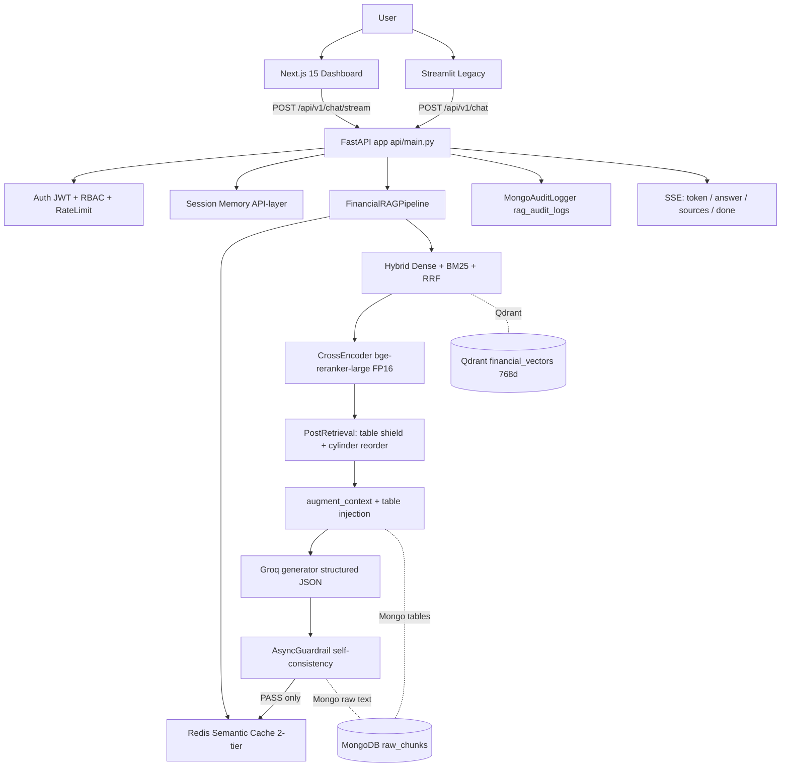

# Financial RAG

An enterprise-style Retrieval-Augmented Generation system for analyzing SEC financial reports — with table-aware retrieval, fiscal-year reasoning, multi-company comparison, conversational memory, grounding, security, caching, and a production-oriented engineering stack.

---

## Overview

Financial RAG ingests SEC 10-K filings (HTML/SGML/TXT/IPCCs) and API uploads (PDF/DOCX/HTML/TXT), indexes them into a dual document + vector store, and answers grounded financial questions with a dense+sparse hybrid retriever, a cross-encoder reranker, table-aware context construction, a Groq LLM generator, and an async hallucination guardrail. It ships a FastAPI backend (auth, RBAC, rate limiting, SSE streaming, audit logging, analytics) consumed by a Next.js 15 dashboard and a legacy Streamlit client.

**What problem it solves.** Financial filings are long, form-heavy documents where the answers live in tables, not prose. Answers depend on *which* fiscal year you mean, frequently compare multiple companies, and require exact figures with traceable sources. A generic document Q&A system struggles here because:

- **Numbers live in tables.** Embedded XBRL tables, dense income statements, and segment breakdowns are shredded by naive sentence splitting.
- **Fiscal-year ambiguity.** "Revenue" means different things for FY2024 vs FY2025 vs FY2026, and query phrasing is inconsistent (`FY2025`, `Fiscal Year 2025`, `FY-2025`).
- **Cross-entity questions.** "Compare Apple, Microsoft, and NVIDIA margins" needs balanced evidence from *each* ticker, not just the one that ranks highest.
- **Hallucination is dangerous.** A fluent but wrong revenue figure is worse than a refusal.

**Main engineering challenges addressed:**

- Data-oriented tokenization and **detrimental pagination-free routing** of E2E fiscal-year questions
- Table-aware chunking, table → Markdown conversion, table placeholder isolation, and query-grounded table injection under a shared context token/character budget
- Deterministic, idempotent chunk identifiers and dual-store consistency
- Hybrid retrieval (dense + BM25 with native score fusion) and FP16-accelerated cross-encoder reranking with CPU fallback
- Conversational coreference across turns ("the second company")
- Guardrails, semantic caching, streaming, authN/authZ, audit, and monitoring

> For deep architectural detail, see the **[Project Map](PROJECT_MAP.md)** — this README is the high-level entry point.

---

## What the System Can Do

Every item below is implemented and used by the default production configuration (see **[Project Map §3](PROJECT_MAP.md#3-system-capabilities)** and §26 for the known-limitation caveats).

| Capability | Notes |
|---|---|
| SEC financial-report analysis | Parses SEC 10-K filings: HTML/TXT/SGML plus API-uploaded PDF/DOCX/HTML/TXT; financial-text cleaning that protects `(...)` negatives, `$` scales, and percentages |
| Table-aware retrieval | Each `<table>` becomes an atomic Markdown chunk; tables are isolated through the pipeline and re-injected by query in context construction |
| Single-company questions | `AAPL`, `MSFT`, `NVDA` supported |
| Multi-company comparison | Cross-entity questions auto-detect tickers (incl. `ticker=ALL`) and run balanced per-ticker sub-retrieval merged by `chunk_id` |
| Fiscal-year-aware questions | `FY2025` / `Fiscal Year 2025` / `FY-2025` normalize to a canonical `"2025"` filter and drive table injection |
| Conversational follow-ups | Session-scoped memory resolves cross-turn coreference ("the second company") |
| Grounded answers with sources | Responses carry `ticker - fiscal_year - section - page` provenance |
| Refusal / negative-query handling | Unsupported / absent figures return a controlled "not available" message instead of fabricated numbers |
| Semantic caching | Two-tier Redis cache (static vs ad-hoc); only verified answers are written back |
| Streaming | SSE `token → answer → sources → done`; word-granular decoded answer text |
| Authentication / RBAC / security | JWT, bcrypt, role-based admin gating, rate limiting, token revocation, HttpOnly refresh cookie |
| Monitoring / audit / evaluation | Structured JSON logs, full per-request Mongo audit traces, analytics endpoints, MLflow tracking |

---

## Architecture



**Request lifecycle.** `POST /api/v1/chat/stream` restores session memory → `pipeline.query_stream()` → fiscal-year normalization and multi-ticker detection → optional semantic-cache lookup → hybrid retrieval (dense Qdrant ANN + BM25 → native score fusion) → post-retrieval (rerank 40→8, table shield, cylinder reorder) → table-placeholder resolution → `_augment_context` (query-grounded table injection under a 12,000-char budget) → context formatting to XML → Groq generator → guardrail → cache write-back (pass only) → SSE events → audit log. The pipeline itself is **stateless**; per-session memory is held at the API layer (§11 of the Project Map).

---

## RAG Pipeline

The pipeline stages, and *why* each one exists:

1. **Parsing** — SEC HTML/SGML is cleaned (boilerplate, scripts, XBRL inline tags removed) and every `<table>` is converted to Markdown and replaced with a `%%TABLE_n%%` placeholder so tables are never shredded by later steps.
2. **Cleaning** — an 8-step pass protects financial notation (`(...)` negatives, `$M/$B` scales, percentages) before whitespace collapse, so tokenization doesn't corrupt numbers.
3. **Chunking** — three tiers: section-level splits → atomic table isolation → recursive 768–1024 token split (20% overlap). Each chunk gets deterministic metadata (ticker, fiscal year, section, type) and an md5-based `chunk_id`.
4. **Embedding & indexing** — `nomic-ai/nomic-embed-text-v1.5` (768-dim, CUDA) embeds chunks into Qdrant (`financial_vectors`); raw text + full metadata live in MongoDB (`raw_chunks`) for hydration, table injection, and guardrails. A unique `chunk_id` index makes re-ingestion idempotent.
5. **Hybrid retrieval** — dense ANN (Qdrant) and BM25 (over the pre-filtered Mongo corpus) are fused by native score fusion (RRF, k=60) into a top-40 candidate set. A "table rescue" path boosts segment-keyword queries to ensure financial tables survive the funnel.
6. **Cross-encoder reranking** — `BAAI/bge-reranker-large` narrows 40 → 8 chunks with higher precision than cosine distance alone, running in FP16 on GPU with an automatic FP32 CPU fallback.
7. **Post-retrieval shaping** — TableShield passes tables through intact (compacting oversized table text) and a cylinder reorder mixes the ranking so the LLM sees varied evidence order.
8. **Context construction** — `_augment_context` walks ranked chunks up to a shared 12,000-char budget, then injects the *right* supplementary tables per ticker/year gated on query terms and table-size bands.
9. **Generation** — Groq (`openai/gpt-oss-120b`, fallback `-20b`) returns a structured JSON `{internal_thought, extracted_raw_data, answer, sources}` with temperature 0.0, a strict zero-hallucination CFO prompt, and a `MULTI-COMPANY COMPARISON MODE` directive for cross-ticker queries. Retries with exponential backoff, then fallback model, then a safe message.
10. **Grounding / guardrail** — the async guardrail checks that every number in the answer appears in the model's own `extracted_raw_data` (self-consistency). A failing answer is replaced with a safe fallback and **not** written to the cache. *(Limited to self-consistency — see §Known Limitations.)*
11. **Streaming** — SSE events decode the top-level `answer` word-by-word; thought and raw data are never surfaced.

---

## Financial Reasoning Example

The system indexes AAPL, MSFT, and NVDA 10-K filings for multiple fiscal years. Consider these verified behaviors:

**Fiscal-year correctness.** "What was NVIDIA's Data Center revenue in FY2026?" resolves `FY2026` → filter `fiscal_year="2026"` and injects the FY2026 Data Center table, producing the grounded answer **"NVIDIA's Data Center revenue in FY2026 was $108,400M (+128.1%)"** with non-zero grounding data. This matters because the same question for FY2025 or FY2024 would differ by billions — a naive system that ignores the year returns a wrong-but-plausible number.

**Multi-company comparison.** Balancing evidence per ticker (the batched multi-ticker path retrieves a comparable number of chunks for `AAPL`, `MSFT`, and `NVDA`, merged and de-duplicated by `chunk_id`) lets "Compare Apple, Microsoft, and NVIDIA margins" return a side-by-side result rather than favoring whichever company's text ranked highest.

**Table-aware retrieval is why numbers are right.** Income-statement and segment figures live in tables; table-isolation + query-grounded table injection ensure those figures (e.g. Apple FY2025 total revenue **$416,161M**) reach the LLM in structured form instead of being truncated or mixed by generic chunking.

---

## Engineering Highlights

Selected as **problem → decision → result** when a result is verified.

### FP16 cross-encoder reranking
- **Problem:** `bge-reranker-large` on GPU is the retrieval-latency hotspot.
- **Decision:** run the cross-encoder in FP16 (`RERANKER_DTYPE=float16`), with a float32 CPU fallback for non-GPU deployments and strict per-parameter dtype verification.
- **Result:** ~66–70% rerank latency reduction and ~50% lower VRAM with **identical top-8 ranking** vs FP32 on a validation set (7 real queries), pipeline-context chunk lists bit-identical, and real E2E answers unchanged ([`artifacts/ab2_benchmark/fp16_impl_report.md`](artifacts/ab2_benchmark/fp16_impl_report.md)).

### Table preservation through the whole chain
- **Problem:** standard paragraph-tokenization destroys financial figures.
- **Decision:** tables become atomic Markdown chunks with placeholder substitution at parse time; TableShield keeps them intact through reranking; `_augment_context` re-injects query-relevant tables under a shared budget.

### Deterministic, idempotent chunking
- **Problem:** re-ingesting a filing would duplicate or re-key every chunk.
- **Decision:** `chunk_id = md5(ticker:fiscal_year:type:source:index)` → `{TICKER}_{txt|tbl}_{hash}_{index}`; Mongo upserts on a unique `chunk_id`, Qdrant point id = `uuid5(chunk_id)`.
- **Result:** re-ingestion is idempotent (with a known caveat: stale ids are not deleted — §Known Limitations).

### Budget-aware context construction
- **Problem:** naive `top-3` context assembly could bury an important chunk and blow the token budget.
- **Decision:** a shared 12,000-char budget walks ranked docs (trimming each to 1,500 chars) and gates table injection on per-slot caps divided across tickers.

### Fiscal-year query normalization
- **Problem:** users write `FY2025`, `Fiscal 2025`, `FY-2025`, `fy2025`.
- **Decision:** a single regex normalizes all to canonical `"2025"` and drives both the retrieval filter and table metadata (`Fix B` threads the API `fiscal_year` query param into stored metadata).

### Conversation memory at the API layer
- **Problem:** multi-turn coreference needs history, but persisting full RAG context to memory causes 413/token blowups.
- **Decision:** the pipeline stays stateless; the API keys prior *questions* by `session_id` and swaps them into the shared generator's memory per request — enabling "the second company" resolution while keeping the context stateless.

### Semantic cache with grounding gate
- **Problem:** repeated expensive queries, but caching unverified answers spreads hallucination.
- **Decision:** a two-tier Redis semantic cache (static vs ad-hoc) that only receives answers that **passed** the guardrail, keyed by ticker/year/trace.

### Streaming architecture
- **Problem:** Groq JSON mode coalesces the whole response into one provider chunk — raw token streaming yields no live text.
- **Decision:** a streaming JSON extractor incrementally decodes the `answer` value and emits whitespace-delimited words over SSE; thoughts and raw data are never surfaced.

### Resilience & fallbacks
- Cross-encoder exceptions degrade to a stable empty-score result; LLM failures retry then fall back to a smaller model then a safe refusal; Redis being down disables caching (blacklist/rate-limit degrade) without taking the rest of the app down; MLflow fetch failure falls through to direct pipeline instantiation so the app always boots.

---

## Performance & Validation

Results are labeled by evidence strength. See **[Project Map §21](PROJECT_MAP.md#21-testing--validation)** for the source files.

### Validated (live/production-path evidence)

| Item | Result |
|---|---|
| FP16 reranker | Latency −66–70%, VRAM −50%, **identical top-8** ranking vs FP32; 5 real E2E queries incl. a refusal and a coref case all pass |
| Fiscal-year E2E regression | `EXIT: PASS` — `FY2025` variant, exact-`FY2025` margin, supplementary table injection, primary model, no refusal |
| FY2026 supplement repro | Retrieval → context → LLM verified: Data Center `$108,400M / +128.1%` with non-zero grounding data |
| `Fix B` fiscal metadata | Validated against the real `_ingest_document` — chunk stored with `fiscal_year='2026'` (`FIXB_PASS`) |
| Reranker dtype tests | 12 dedicated tests + 28 existing pass (40 total) |

### Production configuration (default runtime)
- `RERANKER_DTYPE=float16`; `HYBRID_TOP_K=40`, RRF `k=60`, rerank `top_n=8`; context budget `12,000` chars; chunk 768–1024 tokens / 20% overlap; primary model `openai/gpt-oss-120b`.

### Historical (recorded, not re-run against the current working tree)
- **Version 7 quality-gate scores** (25-sample testset, judge `qwen/qwen3.6-27b`): Faithfulness **0.990**, Answer Relevance **0.920**, Context Precision **0.845**, Context Recall **0.847** — recorded in `artifacts/EVALUATION_SUMMARY.md`. Labeled **historical** because the gate was not re-run against the current working tree.
- The earlier "447/447 full-suite pass" claim is likewise historical, not re-proven.

### Test-suite status (current)
- Targeted runs: **88 passed, 4 known pre-existing failures** (a cache-miss expectation and an MLflow metrics test in `test_pipeline_orchestrator.py`; two `UnboundLocalError` pre-retrieval tests). The **full native suite has not been validated** in the current working tree (an interrupted earlier run stopped near 64%).

---

## Technology Stack

| Layer | Technology |
|---|---|
| Frontend | Next.js 15.5.23 (React 19), Tailwind v4, shadcn/ui, Recharts (dashboard SPA); Streamlit (legacy thin client) |
| API / backend | FastAPI, Uvicorn, Pydantic v2, slowapi, SSE (`sse-starlette`) |
| LLM generation | Groq — `openai/gpt-oss-120b` (primary), `openai/gpt-oss-20b` (fallback); structured JSON output |
| LLM judge (eval only) | `qwen/qwen3.6-27b` (primary), `openai/gpt-oss-120b` (fallback) |
| Embeddings | `nomic-ai/nomic-embed-text-v1.5` (768-dim, CUDA) |
| Reranker | `BAAI/bge-reranker-large` cross-encoder (FP16 default, FP32 CPU fallback) |
| Vector database | Qdrant (embedded `path=` local mode, `financial_vectors`, 768-dim Cosine, HNSW) |
| Document / datastore | MongoDB (`raw_chunks`, `users`, `rag_audit_logs`) |
| Cache / queue / rate-limit / auth-blacklist | Redis |
| ML / evaluation / observability | MLflow (SQLite), RAGAS-style judge evaluator, structured JSON logging, per-request Mongo audit |
| Infrastructure / development | Python 3.12, torch 2.13.0+cu130, WSL2 native (ext4), no Docker (Qdrant embedded; Mongo/Redis native services) |

---

## Project Structure

```
Financial_RAG/
├── app/api/            FastAPI: main.py (endpoints, session memory, SSE, upload/ingest,
│                       audit, analytics), schemas.py, worker.py (Arq), rate_limiter.py,
│                       db_logger.py, parsers.py, auth/ (JWT, service, dependencies, router)
├── src/
│   ├── pipeline.py     RAG orchestrator: fiscal-year, multi-ticker, context construction
│   ├── model_loader.py 3-tier pipeline loader (cache → MLflow Production → direct)
│   ├── 1_ingestion/    parsing · cleaning · metadata · hybrid chunker · database indexer
│   ├── 2_caching/      redis client · two-tier semantic cache
│   ├── 3_pre_retrieval/ intent router · query expansion (DISABLED by default)
│   ├── 4_retrieval/    hybrid search · reranker · post-retrieval · table shield · cylinder reorder
│   └── 5_generation/   generator · async guardrail · streaming JSON extractor
├── config/             settings.py (env-driven) · logging_config.py (JSON logger)
├── evaluation/         synthetic generator · batch runner · judge evaluator · MLflow tracker
├── frontend/           Next.js 15 dashboard (auth, chat, upload, analytics)
├── test/               ~29 files / ~495 test functions (see §11 Testing)
├── scripts/            operational + benchmark + diagnostic scripts (see Project Map §22)
├── artifacts/          benchmarks (ab/ab2 incl. FP16 reports), evaluation results
├── docs/               forensic/audit write-ups, multi-hop roadmap (planned)
├── data/               SEC corpus (AAPL/MSFT/NVDA 10-K), Qdrant store
├── results/            validation/graphic evidence (guardrail, multi-ticker, retrieval, MLflow)
└── requirements.txt    pinned runtime deps (torch 2.13.0+cu130)
```

*Full inventory, including every module and file, is in **[Project Map §4](PROJECT_MAP.md#4-repository-structure)**.*

---

## Testing & Evaluation

- **Stage & integration tests (29 files, ~495 functions):** ingestion stages and E2E, caching, hybrid search, reranker (+ 12 FP16-dtype tests), table shield, cylinder reorder, generation (stage + E2E), pipeline orchestrator, fiscal-year resolution, API endpoints, streaming, upload parser, warm-up, Arq worker, CORS, auth, and issue-regression suites. The shared fixture env disables rate limiting and mocks/disconnects the stores.
- **Fiscal-year integration regression** (`scripts/_fy_integration_regression.py`): asserts canonical year resolution, supplementary table injection counts, evidence figures, primary-model usage, and no refusal — passes E2E.
- **E2E repros:** `scripts/_fy26_repro.py` traces retrieval → context → LLM → grounding for the FY2026 supplement; `Fix B` is validated against the real ingest path.
- **Grounding / negative testing:** the E2E benchmark includes a refusal case (a ticker not in the corpus must be refused, not fabricated).
- **Reranker equivalence:** FP16 vs FP32 top-8 overlap and Jaccard = 1.0 on 7 real queries; pipeline-context chunk lists bit-identical.

> The full native suite is not yet validated in the current working tree (see §Performance & Validation). Validation status is reported precisely rather than assuming green.

---

## Security & Production Engineering

**Implemented:**
- **Authentication:** JWT (HS256) short-lived access token + HttpOnly refresh cookie; bcrypt password hashing; token revocation via Redis blacklist on logout; refresh rotation.
- **Authorization (RBAC):** `require_roles(["admin"])` gates privileged mutations — admin user management, role updates, `/db/clear`, admin ingest, `DELETE /api/v1/cache`.
- **Rate limiting:** slowapi with a dynamic key (authenticated `user:<id>` vs guest `ip:<host>`); structured 429 responses with rate-limit headers.
- **Audit & observability:** structured JSON logs; full per-request Mongo `rag_audit_logs` (query, retrieved chunks, prompts, response, latency, guardrail, cache, model); HTTP middleware with request-id echo; analytics endpoint computing latency/cache-hit/guardrail percentiles.
- **Configuration hygiene:** `.env` runtime keys are honoured (Mongo + Redis now map from their legacy names); JWT secret, model keys, and DB URIs are kept out of source; secret values are redacted throughout documentation.
- **Resilience:** guarded fallbacks across LLM, reranker, cache, MLflow, and store outages (see §Engineering Highlights).

**Implemented but with known caveats (see §Known Limitations):** guest/optional authentication on the chat + upload + analytics endpoints (intended for the Streamlit client) and on the frontend `/chat/stream` call.

**Not implemented / planned:** multi-hop/agentic retrieval (see the [multi-hop roadmap](docs/MULTI_HOP_ROADMAP.md)).

---

## Known Limitations

Honest, verified limitations (full list in **[Project Map §26](PROJECT_MAP.md#26-known-limitations-verified)**):

1. **Streaming is word-granular at best.** Groq's JSON mode coalesces output; the API emits decoded-word SSE events, not true token-level text.
2. **Guardrail is self-consistency only.** It verifies answer numbers against the model's own `extracted_raw_data` — it does **not** re-query MongoDB raw text and performs **no arithmetic**.
3. **Session memory is not concurrency-safe** and is RAM-only (lost on restart). The API swaps a single shared generator's message list per request without a lock.
4. **Bare years are unsupported.** A query of just `"2025"` (no `FY`/`fiscal`) does not drive filtering; plural/complex fiscal phrases are unsupported. Multi-year comparison queries resolve to the max year by design.
5. **Re-ingestion is not convergent.** Upserts are idempotent per `chunk_id`, but stale ids are never deleted — orphaned/duplicate chunks persist until a full `--reset`.
6. **Pre-retrieval is disabled and buggy.** The intent-routing/query-expansion layer (`ENABLE_PRE_RETRIEVAL=False`) raises `UnboundLocalError` on its sync path if enabled.
7. **Some API responsibilities are hard-coded.** `guardrail_status` in the sync `/chat` response is a fixed `passed=True` (the real result only in audit logs); `/health` probes an in-code Mongo URI; an in-memory `_INGESTION_TASKS` map loses task state on restart.
8. **`.env` keys are only partially reconciled.** Legacy Mongo and Redis names are now honoured; `QDRANT_URL` and `MLFLOW_TRACKING_URI` are still unread.
9. **Frontend gaps.** Overview/Comparison and some upload rows are mock data; `documents`/`admin_logs` tabs are stubs; the SPA calls `/chat/stream` without an Authorization header; auth endpoints are not rate-limited; the embedded model has a hard CUDA assert (no CPU fallback); a dev JWT secret fallback exists.
10. **Validation is partial.** The current working tree is uncommitted WIP; the full native test suite is not yet validated, and the Version 7 quality-gate scores are historical.

---

## Future Roadmap

Realistic, current-direction improvements (not yet implemented):

- **Multi-hop / agentic retrieval** for complex multi-step financial questions (see [`docs/MULTI_HOP_ROADMAP.md`](docs/MULTI_HOP_ROADMAP.md), PLANNED).
- **Convergent re-ingestion** (delete-by-prefix) so re-chunking never orphans chunks.
- **Ground-truth guardrails** that verify figures against raw document text (and optionally arithmetic), not just self-consistency.
- **True token-level streaming** (working around provider JSON coalescing).
- **Full native-suite validation** for the current working tree, including the FP16 reranker under load.
- **Hardening** the remaining security gaps: rate-limit the auth endpoints, attach the JWT to the frontend stream call, and replace the dev secret in real deployments.

---

## Documentation

- **[PROJECT_MAP.md](PROJECT_MAP.md)** — the authoritative, code-verified architecture reference (30 sections + diagrams + verified-behavior tables). Read this for deep detail; it is the source of truth for everything summarized here.
- **[FP16 reranker report](artifacts/ab2_benchmark/fp16_impl_report.md)** — problem/decision/result plus reproduction for the FP16 optimization.
- **[Evaluation summary](artifacts/EVALUATION_SUMMARY.md)** — recorded Version 7 quality-gate results (labeled historical — not re-run against the current tree).
- **[Multi-hop roadmap](docs/MULTI_HOP_ROADMAP.md)** — planned agentic capability.
- `docs/` — forensic audit write-ups (`AUDIT_*.md`, `SUBSET_AUDIT_REPORT.md`, `SYSTEM_AUDIT_REPORT.md`).

This README is the high-level entry point; **[PROJECT_MAP.md](PROJECT_MAP.md)** contains the deeper architectural detail.

---

## Author

**Youssef** — AI Engineering • RAG Systems • Data Science